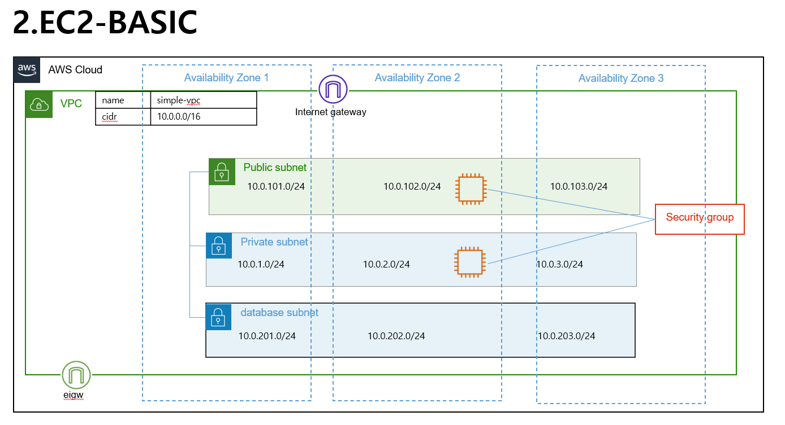

### EC2 BASIC 구성하기 

구성도 



### 구성에 필요한 정보는  사전에 작성된 vpc.output에서 변수 값으로 받아옴


>vpc 정보 확인 부분 
```bash
data "terraform_remote_state" "vpc" {
  backend = "local"
  config = {
    path = "../vpc/terraform.tfstate"
  }
}
```

>사용자 입력 부분 

``` bash
### 사용자 입력 부분 ###


### 사용자 입력 부분 ###

locals {
  name   = "example-ec2-complete"
  region = "ap-northeast-2"
  vpc_name = "simple-vpc"
  service_name = "webserver"
  key_name = "cloud"
  ami = "ami-0e5732e0fc87ab42e"
  instance_type = "t2.micro"
  pub = 1           # public 에 생성할 서버 수량
  priva = 1         # private에 생성할 서버 수량
  owner = "jaeyonglee"
  team = "infra-1"
  
  
  
  ######### Don't touch #######################################
  public_sub =  data.terraform_remote_state.vpc.outputs.public_subnets
  private_sub = data.terraform_remote_state.vpc.outputs.private_subnets
  database_sub = data.terraform_remote_state.vpc.outputs.database_subnets
  security_group_default = data.terraform_remote_state.vpc.outputs.default_security_group_id
  azs = data.terraform_remote_state.vpc.outputs.azs
  user_data = <<-EOT
  #!/bin/bash
  echo "will make script or file after"
  EOT


}

```

private = 1대, public = 1대 구성테스트 정상 완료 
