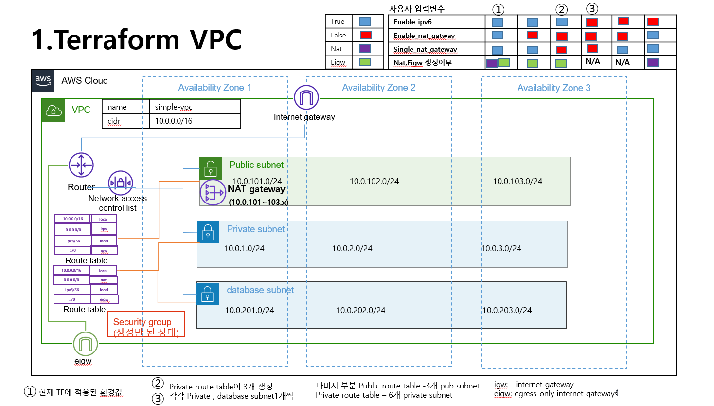

### VPC 구성하기 

구성도 



사용자 입력 부분 

``` bash
locals {

 
  region = "ap-northeast-2"
  project_name = "nevido"
  vpc_name = "simple-vpc"
  cidr = "10.0.0.0/16"
  private_subnets = ["10.0.1.0/24", "10.0.2.0/24", "10.0.3.0/24"]
  public_subnets  = ["10.0.101.0/24", "10.0.102.0/24", "10.0.103.0/24"]
  database_use = true
  database_subnets  = ["10.0.201.0/24", "10.0.202.0/24", "10.0.203.0/24"]
  enable_ipv6 = true
  create_vpc = true
  enable_nat_gateway = true
  single_nat_gateway = true
  
}
```
